# System Architecture

This section details the technical design of the Telco Churn Prediction system, including the request flow and data processing pipeline.

## System Flow

The application follows a standard **Client-Server-Serverless** architecture. The User interacts with a Streamlit interface, which proxies requests to an Azure Function hosting the ML model.

```mermaid
sequenceDiagram
    autonumber
    actor User as 👤 Business User
    participant Dash as 📊 Streamlit Dashboard<br>(Frontend)
    participant API as ⚡ Azure Function<br>(Inference API)
    participant Model as 🤖 ML Model<br>(Logistic Regression)

    User->>Dash: Inputs Customer Data
    Note right of User: Tenure, Monthly Charges,<br>Services, etc.
    
    User->>Dash: Clicks "Run Prediction"
    
    activate Dash
    Dash->>Dash: Validates Input
    
    Dash->>API: POST /predict (JSON Payload)
    activate API
    
    Note right of Dash: Payload matches<br>model features
    
    API->>Model: predict_proba(features)
    activate Model
    Model-->>API: Probability (0.0 - 1.0)
    deactivate Model
    
    API-->>Dash: JSON Response<br>{ "prediction": 0.75 }
    deactivate API
    
    Dash->>Dash: Calculate Risk Level &<br>Render Visuals
    
    Dash-->>User: Displays Risk Meter &<br>Recommendation
    deactivate Dash
```

## Data Pipeline

The data flows from raw user input through preprocessing before reaching the model. We use `scikit-learn` pipelines to handle scaling.

## Components

| Component | Technology | Description |
| :--- | :--- | :--- |
| **Frontend** | Streamlit | Provides the interactive form and visualization of results. |
| **API** | Azure Functions (Python v2) | Serverless HTTP trigger that hosts the model. |
| **Model** | Scikit-Learn | Logistic Regression model trained on IBM Telco dataset. |
| **Container** | Docker | (Optional) Used for consistent development environments. |
