# Dashboard User Guide

The **Telco Churn Prediction Dashboard** allows you to interactively test the model with customer data.

## User Journey

```mermaid
graph LR
    A[👤 Login] --> B[📝 Input Data]
    B --> C{⚡ Run Prediction}
    C -->|Low Risk| D[✅ No Action]
    C -->|High Risk| E[🎁 Notify, want to preform an action, like Offer Discount or something]
    style C fill:#f9f,stroke:#333,stroke-width:2px
```

## Interface Overview

The dashboard is divided into three main sections:

1.  **Customer Profile Form**: Input fields for customer data.
2.  **Logic & Control**: The "Run Prediction" button.
3.  **Results Display**: The risk probability and recommendation.

### 1. Customer Profile Inputs

Enter the customer's current details in the form.

!!! example "Scenario: Meet Bob 👨"
    **Bob** has been with us for only **2 months** (New customer). He pays **$90/month** (High bill) and is on a **Month-to-Month** contract.
    
    *   **Expectation**: Bob is likely **High Risk**.
    *   **Action**: Input `Tenure=2`, `Monthly=$90`, `Contract=Month-to-Month`.

!!! tip "Tip: Default Values"
    The form comes pre-filled with "average" customer values to help you get started quickly.

| Field | Type | Range/Values | Description |
| :--- | :--- | :--- | :--- |
| **Tenure** | Slider | 0 - 120 months | How long the customer has been with the company. |
| **Monthly Charges** | Number | $0 - $1000 | Current monthly bill amount. |
| **Tech Support** | Checkbox | Yes / No | Subscribed to technical support service? |
| **Fiber Optic** | Checkbox | Yes / No | Using high-speed Fiber Optic internet? |
| **Month-to-Month** | Checkbox | Yes / No | Is the contract flexible (monthly)? |

### 2. Running a Prediction

Once you have entered the data, click the **Run Prediction** button.

!!! warning "Processing Time"
    The first prediction might take a few seconds if the Azure Function is "cold". Subsequent requests will be much faster.

### 3. Understanding the Results

The dashboard will display a **Churn Probability** score.

-   **Low Risk ✅**: The customer is happy and unlikely to leave.
-   **High Risk ⚠️**: The customer shows signs of churning. Consider offering a retention incentive.

---
**Next Step**: Learn how to [Interpret Predictions](interpreting-predictions.md) in more detail.
