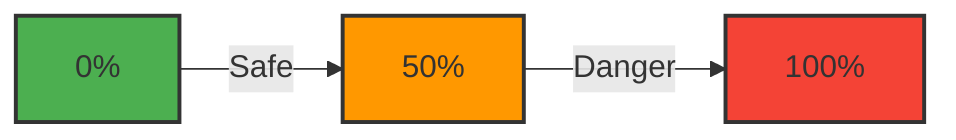

# Interpreting Predictions

Understanding *how* the model makes decisions, and *what* the risk score means, is crucial for business action.

## The Risk Score

The model outputs a probability between **0%** (0.00) and **100%** (1.00).

!!! abstract "Risk Levels"
    -   **Safe Zone (< 50%)**: The customer is stable.
    -   **Danger Zone (> 50%)**: The customer is at risk of churning.

The dashboard uses a visual **Risk Meter** to represent this:

## Key Drivers of Churn

Our Logistic Regression model has identified several key factors that influence churn:

### 🔻 Factors that REDUCE Churn (Good)
*   **High Tenure**: Long-term customers are less likely to leave.
*   **Tech Support**: Customers who engage with support services tend to stick around.
*   **Contracts**: Long-term contracts (1-year, 2-year) provide stability.

### 🔺 Factors that INCREASE Churn (Bad)
*   **Month-to-Month Contracts**: Flexible contracts make it easier for customers to switch providers.
*   **Fiber Optic Service**: Surprisingly, Fiber Optic users churn more often (possibly due to high price or competition).
*   **High Monthly Charges**: Higher bills correlate with higher churn risk.

!!! question "Why does Fiber Optic increase churn?"
    This is a common question! It might be because fiber customers are more "tech-savvy" and price-sensitive, frequently switching to get the best deal, or simply that the fiber service has higher competition in the market.

## Confidence & Accuracy

The model uses **Logistic Regression**, which is highly interpretable. It achieves an accuracy of approximately **80%** on the test dataset.

-   **False Positives**: Predicting a customer will churn when they stay. (Risk: We waste money on retention offers).
-   **False Negatives**: Predicting a customer will stay when they leave. (Risk: We lose a customer unexpectedly).

The threshold of **50%** is a balanced starting point, but you can mentally adjust this. For example, if you want to be very aggressive in retaining customers, you might treat anything above **40%** as "at risk".
